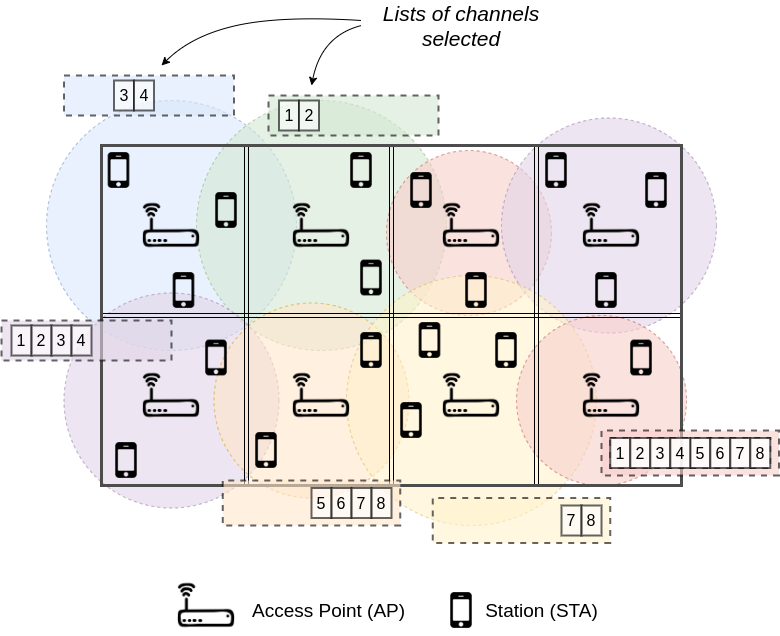

# ITU-ML5G-PS-013
This repository contains the solution of the ML 5G contest organized by ITU:
[https://www.itu.int/en/ITU-T/AI/challenge/2020/Pages/default.aspx](https://www.itu.int/en/ITU-T/AI/challenge/2020/Pages/default.aspx)

Particularly, it corresponds to problem statement 13. Participants have to
forecast the throughput of BSs and STAs in a 802.11 deployment:
[https://www.upf.edu/web/wnrg/ai_challenge](https://www.upf.edu/web/wnrg/ai_challenge)

The slides with the problem statement presentation are available in this repo:
[https://github.com/MartinPJorge/ITU-ML5G-PS-013/blob/master/problem-presentation-slides.pdf](https://github.com/MartinPJorge/ITU-ML5G-PS-013/blob/master/problem-presentation-slides.pdf)



## Dataset
This repository already contains the dataset provided at:
[https://zenodo.org/record/3879458#.XwbRE9HtZPD](https://zenodo.org/record/3879458#.XwbRE9HtZPD)

 * `output-simulator`: contains the output files of the komodor simulator;
 * `input-node-files`: contains the CSVs of the different scenarios;
 * `output-simulator-parsed`: contains the parsed output files in a JSON format;

## Processing procedure
By running
```bash
./extract-outputs.sh output-simulator output-simulator-parsed/ 0
```
we parse the TXT files under `output-simulator` and store in a JSON the output
of each scenario.

During the parsing of the data, we encountered the following errors:
 * `output-simulator/script_output_sce1b.txt`: scenario 028 misses the RSSI data of x2 STAs. Thus, we fill it with the last throughput value;
 * `output-simulator/script_output_sce1a.txt`: scenario 014 misses the RSSI data of x2 STAs. Thus, we fill it with the last throughput value;
 * `output-simulator/script_output_sce1c.txt`: scenario 024 misses the RSSI data of x2 STAs. Thus, we fill it with the last throughput value;

The refered files are sanitized as indicated in this repository.

### v4 data
`input-node-files-v4` and `output-node-files-v4` contain the dataset
files version 4.
Such files contain the *SINR* of the STAs, therefore they need
a different processing.
It is enough to change 0 to 1 in the flag passed as last argument
to `./extract-outputs.sh`.

# Gossip
The `gossip.py` solution creates a dataset `gossip-dataset.csv` with
per-STA information. Each row corresponds to a STA, and the dataset is created
using all STAs present in the different scenarios.

The columns present are the following (as idx is the STA identifier):

| field | description |
|-------|-------------|
| wlan_code | WLAN code the STA is attached to |
| scenario | scenario id, e.g., 'sce1c' |
| deployment | number of the scenario deployment, e.g., '010' |
| node_code | STA node code, e.g., 'STA_A10' |
| node_x | STA x coordinate |
| node_y | STA y coordinate |
| node_z | STA z coordinate |
| ap_x | x coordinate of attached AP |
| ap_y | y coordinate of attached AP |
| ap_z | z coordinate of attached AP |
| primary_channel_neighs | number of neighbors in the primary channel |
| primary_channel_0 | 1 or 0 if channel 0 is or is not, the primary |
| primary_channel_1 | 1 or 0 if channel 1 is or is not, the primary |
| primary_channel_2 | 1 or 0 if channel 2 is or is not, the primary |
| primary_channel_3 | 1 or 0 if channel 3 is or is not, the primary |
| primary_channel_4 | 1 or 0 if channel 4 is or is not, the primary |
| primary_channel_5 | 1 or 0 if channel 5 is or is not, the primary |
| primary_channel_6 | 1 or 0 if channel 6 is or is not, the primary |
| primary_channel_7 | 1 or 0 if channel 7 is or is not, the primary |
| allowed_channel_0 | 1 or 0 if STA is allowed to transmit over channel 0 |
| allowed_channel_1 | 1 or 0 if STA is allowed to transmit over channel 1 |
| allowed_channel_2 | 1 or 0 if STA is allowed to transmit over channel 2 |
| allowed_channel_3 | 1 or 0 if STA is allowed to transmit over channel 3 |
| allowed_channel_4 | 1 or 0 if STA is allowed to transmit over channel 4 |
| allowed_channel_5 | 1 or 0 if STA is allowed to transmit over channel 5 |
| allowed_channel_6 | 1 or 0 if STA is allowed to transmit over channel 6 |
| allowed_channel_7 | 1 or 0 if STA is allowed to transmit over channel 7 |
| rssi | RSSI level of AP giving connection |
| q1_rssi | 1st quantile of neighbors RSSI to the AP |
| q2_rssi | 2st quantile of neighbors RSSI to the AP |
| q3_rssi | 3st quantile of neighbors RSSI to the AP |
| q4_rssi | 4st quantile of neighbors RSSI to the AP |
| sinr | SINR level of AP giving connection |
| q1_sinr | 1st quantile of neighbors SINR to the AP |
| q2_sinr | 2st quantile of neighbors SINR to the AP |
| q3_sinr | 3st quantile of neighbors SINR to the AP |
| q4_sinr | 4st quantile of neighbors SINR to the AP |
| agg_interference | aggregated interference perceived by the AP |
| channel_0_interference | interference perceived by the AP in channel 0 |
| channel_1_interference | interference perceived by the AP in channel 1 |
| channel_2_interference | interference perceived by the AP in channel 2 |
| channel_3_interference | interference perceived by the AP in channel 3 |
| channel_4_interference | interference perceived by the AP in channel 4 |
| channel_5_interference | interference perceived by the AP in channel 5 |
| channel_6_interference | interference perceived by the AP in channel 6 |
| channel_7_interference | interference perceived by the AP in channel 7 |
| throughput | STA througput |


## Create a new dataset for Gossip
Using the output JSONs extracted to `output-simulator-parsed/`, and the input
files present under `input-node-files/`; we can create a dataset to feed the
Gossip solution:
```bash
python3 gossip.py 50 \
    --new_dataset gossip-dataset-v4.csv\
    --input_dir input-node-files-v4\
    --parsed_output_dir output-simulator-v4-parsed
```
This is how it was created the `gossip-dataset-v4.csv` in this repo
(ignore the 50 parameter).


## Train a Gossip model
To train a Gossip model you have to execute the following line:
```bash
python3 gossip.py 50 --dataset gossip-dataset.csv --model /tmp/gossip-trained-model --train --episodes 100
```
This line will train a model stored under `/tmp/gossip-trained-model`. The
training consists of 100 episodes in which the gradient descend is performed
over batches of size 50.

## Use a Gossip model
To forecast the throughput of every STA and AP in a scenario, first one must
create a dataset of the corresponding scenario.

Lets assume the test corresponds to a single deployment in a given scenario
named **0t**.
If we have files `input_nodes_sce0t_deployment_000.csv`, and
`script_output_sce0t.txt`; with the latter containing the single
scenario:
```bash
cat script_output_sce0t.txt

KOMONDOR SIMULATION 'sim_input_nodes_sce0t_deployment_000.csv' (seed 1992)
{201.22,26.80,30.41,3.00,35.94,44.39,25.57,35.10,214.58,6.37,24.42,23.27,15.59,28.42,21.96,29.18,14.44,29.49,21.43,83.50,19.43,2.15,18.51,5.90,17.89,2.71,16.65,0.14,0.12,81.33,1.92,9.45,0.31,2.76,12.29,6.14,15.59,9.98,22.89,97.78,17.82,17.74,4.79,18.28,17.13,13.89,8.14,74.57,10.14,6.60,6.45,10.44,0.00,4.45,2.46,14.59,17.66,1.77,106.80,6.36,9.26,12.66,15.12,16.05,12.84,14.13,7.73,12.66,104.37,24.96,14.52,13.52,24.50,3.92,22.96}
{0.57,0.73,3.01,1.28,35.89,14.91,0.62,22.75}
{Inf,-69.06,-69.65,-70.37,-53.55,-63.60,-67.86,-57.58,Inf,-68.77,-64.17,-69.56,-64.63,-71.08,-69.64,-60.88,-68.56,-61.00,-71.30,Inf,-50.92,-67.29,-57.33,-67.98,-57.11,-67.78,-63.95,-66.91,-67.47,Inf,-70.56,-68.94,-70.92,-66.57,-66.91,-70.62,-65.79,-69.18,-54.88,Inf,-57.65,-54.26,-62.19,-58.85,-54.84,-61.17,-60.33,Inf,-67.41,-70.18,-69.55,-69.66,-71.05,-63.08,-64.60,-59.39,-59.76,-65.40,Inf,-64.56,-65.28,-64.30,-63.45,-56.78,-64.27,-55.02,-63.41,-64.68,Inf,-59.30,-59.35,-67.08,-68.42,-68.24,-59.07}
{Inf,-96.69,-82.35,-103.00,-100.95,-116.67,-119.98,-129.45;
-96.69,Inf,-99.99,-85.36,-110.65,-106.97,-126.44,-122.99;
-85.36,-103.00,Inf,-96.69,-79.34,-103.00,-100.95,-113.66;
-103.00,-85.36,-93.68,Inf,-96.98,-85.36,-110.65,-103.96;
-106.97,-116.67,-82.35,-103.00,Inf,-96.69,-79.34,-99.99;
-116.67,-106.97,-99.99,-85.36,-90.67,Inf,-96.98,-82.35;
-126.00,-132.46,-103.96,-116.67,-79.34,-103.00,Inf,-93.68;
-132.46,-126.00,-113.66,-106.97,-96.98,-85.36,-90.67,Inf}
```

Then one creates dedicated directories to perform the JSON extraction,
and dataset creation as follows:
```bash
mkdir -p input-node-test-files/sce0t
cp /path/to/input_nodes_sce0t_deployment_000.csv input-node-test-files/sce0t
mkdir output-test
cp /path/to/script_output_sce0t.txt output-test

# Create the JSON output-test-parsed/sim_output_nodes_sce0t_deployment_000.json
./extract-outputs.sh output-test output-test-parsed/

# Change the gossip location of files to create the dataset
# inside gossip.py :
#  INPUT_DIR='input-node-test-files'
#  OUT_PARSED_DIR='output-test-parsed'
python3 gossip.py 50 --new_dataset gossip-test-dataset.csv
```

With the code above we have in `gossip-test-dataset.csv` the dataset that
corresponds with the test deployment, and all the information necessary
for Gossip to forecast the per-STA and per-AP throughout as follows:

```bash
python3 gossip.py 100 --dataset gossip-test-dataset.csv --model /tmp/gossip-trained-model

[...]
===========================
= STA throughput forecast =
===========================
node_code real_throughput forecast_throughput
STA_A1 1.32 3.7261900901794434
[...]
STA_L9 0.23 2.867366075515747
=================
= AP throughput =
=================
wlan_code real_throughput forecast_throughput
A 106.98 74.58921813964844
[...]
L 83.11 73.48725891113281
```


# Test data
The contest test data is inside `input-node-files-test`, and
`output-simulator-test` directories; with the simulator input/output data
respectively.

First of all we need to **parse output** data using
```bash

rm -rf output-simulator-test-parsed/*json; # remove previous versions
./extract-test-outputs.sh "output-simulator-test/*" output-simulator-test-parsed

```
this will generate all the parsed outputs in `.json` files under
`output-simulator-test-parsed` directory.

## create test gossip dataset
One the output files are parsed in the expected `.json` format, a new dataset
must be created to perform predictions:
```bash
python3 gossip.py 50 --new_dataset gossip-dataset-test.csv\
    --input_dir input-node-files-test\
    --parsed_output_dir output-simulator-test-parsed
```
and we obtain the `gossip-dataset-test.csv` to derive the predictions of
all scenarios at once.


## derive all predictions
Once the dataset for the test is created, the user may execute
```bash
./forecast-all.sh "input-node-files-test/*"\ # parsed test input
    output-simulator-test-parsed\            # parsed test output
    /tmp/gossip-trained-model-v4\            # TF trained model
    /tmp/predictions                         # directory with predictions
```
and the user will find under `/tmp/predictions` the forecasted
throughput of both STAs and APs of every deployment:
```txt
/tmp/predictions
├── test_1
│   ├── all_throughput_000.csv
│   ├── stas_throughput_000.csv
│   ├── throughput_000.csv
└── test_2
      ...
```
with the last 2 containing both STAs, and APs througput; respectively.

